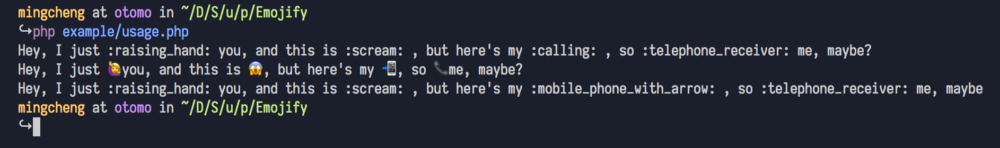

# PHP Emojify - The PHP Port of Emojify



This project was inspired by https://github.com/carpedm20/emoji , writing in PHP.

## Feature

- Including large symbol emoji defintions(about 4022 yet, using `cat data/emoji-huge.txt | wc -l`).
- Small and tiny, without any depends.

## Usage

For more usage u can checkout `example/usage.php` file, basic usage:

```php
require __DIR__ . "/../Emojify.inc.php";

$text = "Hey, I just :raising_hand: you, and this is :scream: , but here's my :calling: , so :telephone_receiver: me, maybe?";

$emojify = new Emojify();
$encoded = $emojify->encode($text);
echo $encoded . "\n";
echo $emojify->decode($encoded);
```

That's it!


## Typecho Plugin

This scripts included the [Typecho](http://typecho.org/) plugin for showing emoji. You can checkout `Plugin.php` file for more details.

`- eof -`

